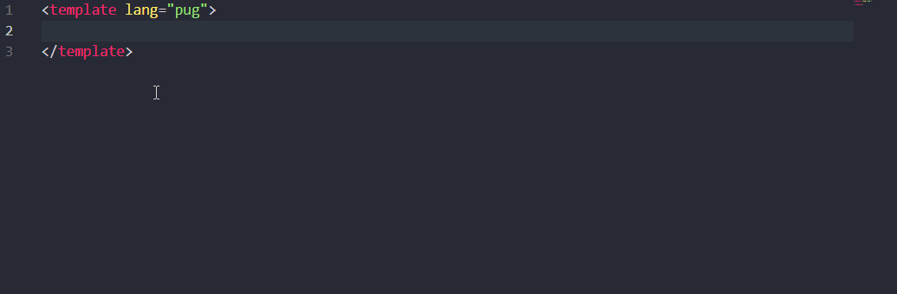
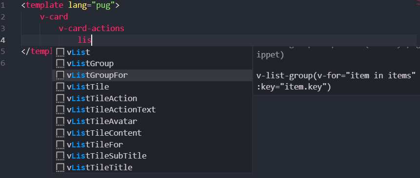
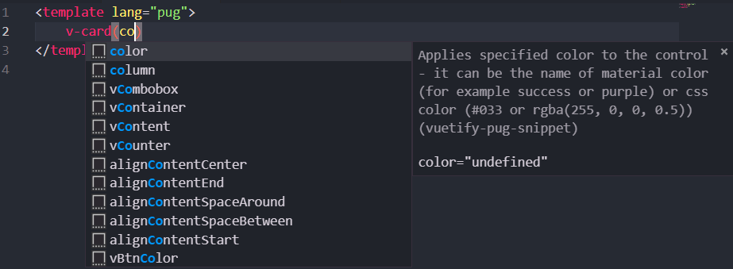

<p align="center">

</p>

# Vuetify Pug snippet


VSCode Snippet for the Vuetify framework using Pug. Type faster with:
* Auto Completion
* Correct writing and indentation.
* Friendly Description



## Features
### Built for Vuetify 2 (in beta).
> From version 0.5.0 the snippet was redone to version 2 of Vuetify. New possibilities, components and benefits. A new structure was made for the snippet.

- Created from Vuetify v2.0.0-beta.5 and Vue 2.
- More than 365 snippets.
- All components of Vuetify 2.
- Now the snippets will have a more friendly description, following the official documentation (in progress).

## Usage
You only have to type a part of the component, VSCode will present you with a list of combinations. Pressing Tab to enter the full component name or even a code skeleton.

Auto Completion


Friendly Description


## Comparison Tags HTML vs Pug
<p>
    
    
    
</p>

No tag pollution, no closing tags, use indentation and understand better.

## Requirements

Installing the pug package via npm - `npm i pug`

Also install via npm - `npm i pug-plain-loader`

The code must be inside a template lang="pug".
```
<template lang="pug">
    //- code start
</template>
```
[VSCode Extesion Vetur](https://marketplace.visualstudio.com/items?itemName=octref.vetur) installed.

## Known Issues
The snippets will be shown for pug code even though it is not a `.vue` file. In this case, if the project is not Vuetify, you can disable it in the workspace.

## Release Notes

Versions, additions and fixes.

[Changelog here](CHANGELOG.md)

-----------------------------------------------------------------------------------------------------------

## Future releases and improvements

**Note:** More snippets will be added in the future. (More and better)

From:

* New releases of Vuetify.
* [Issues](https://github.com/lucaslpsan/vuetify-pug-snippet/issues)

## For more information

* [Vuetify Beta](https://next.vuetifyjs.com/)
* [Pug](https://pugjs.org/)
* [Vetur](https://vuejs.github.io/vetur)

### License
MIT © [lucaslpsan](https://lucaslpsan.github.io/en/)

**Enjoy!**
